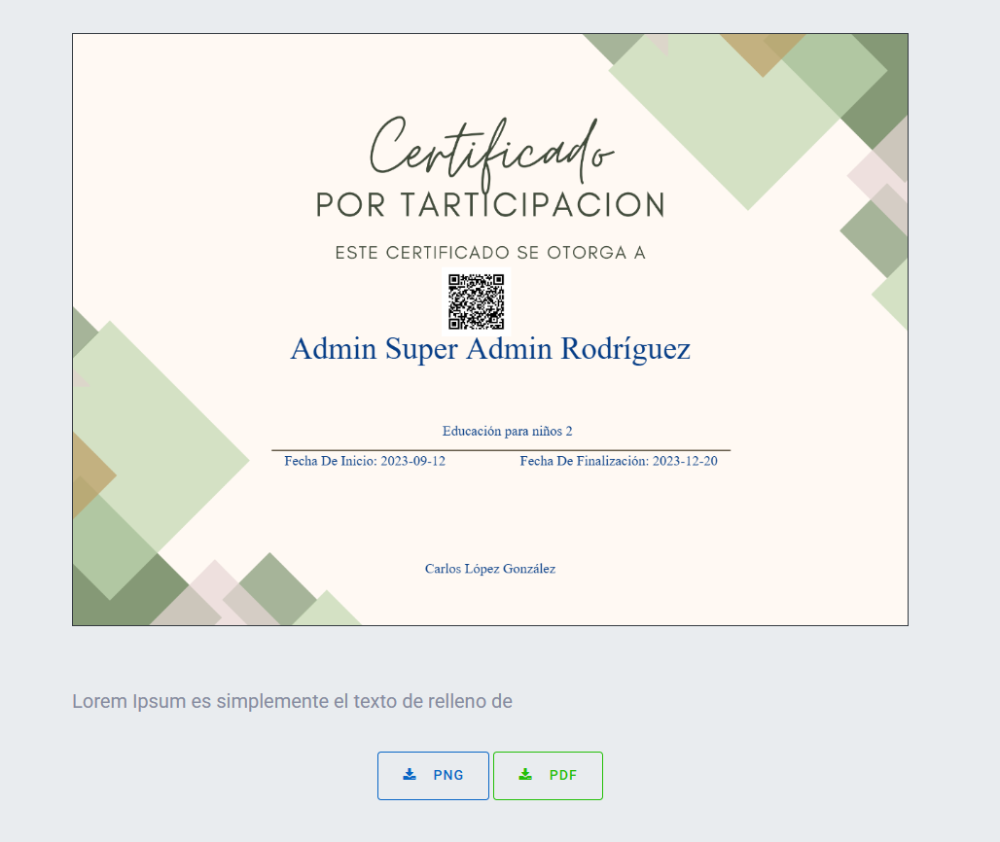

# Personal_CertificadosDiploma
Este proyecto es el resultado del curso de "Generación de Certificados y Diplomas con PHP, MySQL y JS". Se trata de un sistema web desarrollado desde cero utilizando tecnologías modernas y buenas prácticas en el desarrollo web. El sistema permite la gestión y generación de certificados y diplomas de manera dinámica, con un enfoque en la automatización y optimización de procesos.

  

## Tecnologías Utilizadas
- Backend: PHP (POO, PDO)
- Base de Datos: MySQL (Administrado con PhpMyAdmin)
- Frontend: HTML5, CSS3, Bootstrap
- Interactividad y Dinamismo: JavaScript, JQuery, Ajax, JSON
- Gestión y Organización: Gantt, Kanban

  

## Características del Proyecto
- Diseño Responsivo: Adaptado para visualizarse en cualquier dispositivo.
- Gestión de Usuarios: Control de accesos y permisos.
- CRUD Completo: Creación, lectura, actualización y eliminación de registros.
- Manejo de Expresiones Regulares: Para validaciones de formularios.
- Uso de Ventanas Modales: Para mejorar la experiencia de usuario en la gestión de datos.
- Activación/Desactivación de Estados: Funcionalidad de cambio de estado mediante botones interactivos.
- Gestión de Certificados y Diplomas: Generación automática de documentos con información dinámica (QRs).
- Diagramas de Gantt y Tableros Kanban: Organización y seguimiento de tareas del proyecto.

  

## Uso del Proyecto
- Acceder al Panel de Administración.
- Gestionar Usuarios, Certificados y Diplomas.
- Generar Certificados Dinámicos.
- Visualizar y Gestionar Actividades con Kanban y Gantt.
